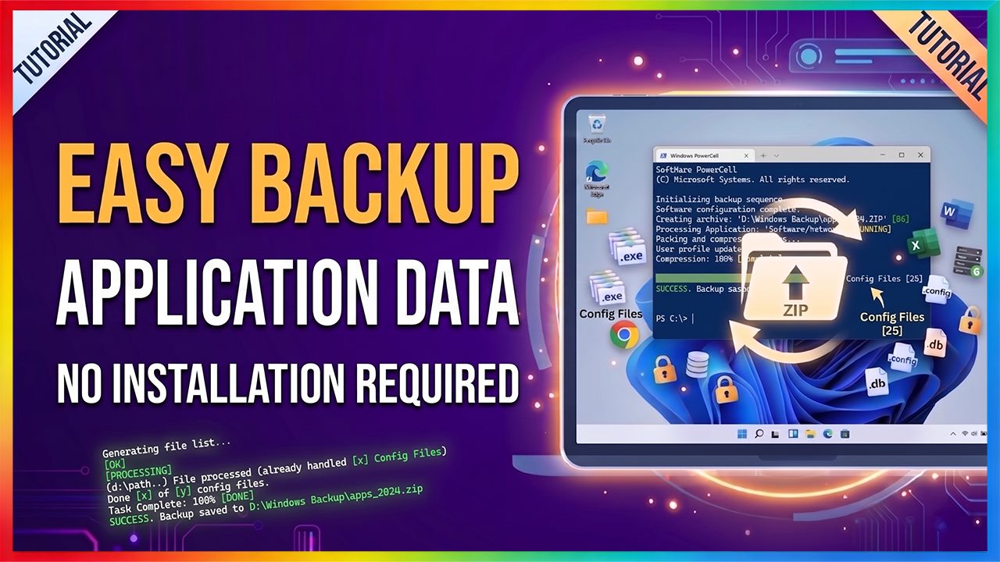
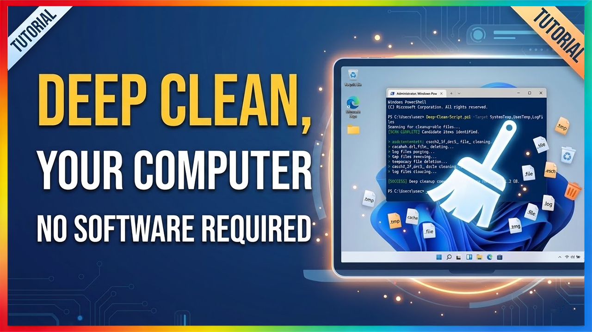
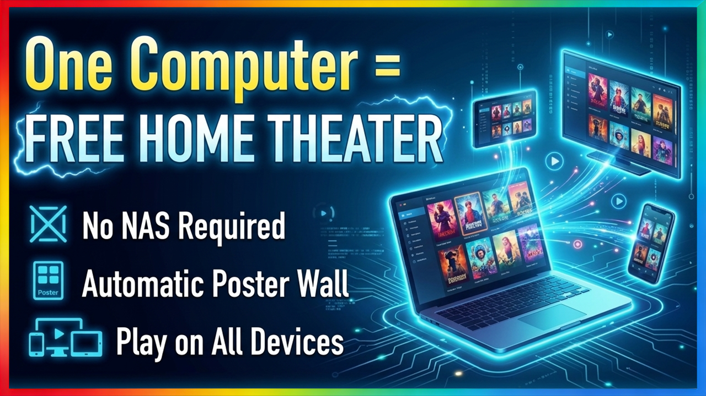
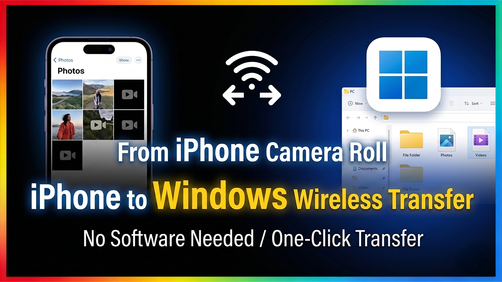

<div align="center">
  
  
  
  
  
  
</div>

---
### 🌐 Select Language
[](README_en.md)
[](README.md)
---
### 🛡️ Official Guidelines
> **Official Channel:** Dedicated to simplifying complex PC tasks. Ensure you are following the official **Lightspeed Sharing (YT)** channel.
> **Secure & Transparent:** Our core code is 100% open-source and open for community review. Feel free to inspect it before running.
> **Exclusive Resources:** All scripts in this repository are tailor-made companions for video tutorials on the **YouTube - Lightspeed Sharing** channel.
---

### 🙋‍♂️ Co-Create the Channel
> **Subscribe to Lightspeed Sharing (YT)**
> **💡 Community Engagement:** Vote in community posts or request custom services. Let your needs shape this space.
>
> 🔗 [Visit My YouTube Channel](https://www.youtube.com/@光速分享)

---

### 🚀 Environment & Usage Guide
> **Global Note:** All scripts on this page are universal. Launch the terminal using any of the methods below, then paste the code to run:
>
> * **Method 1 (Quick Access):** Press `Windows + X` and select `Windows PowerShell` from the menu.
> * **Method 2 (System Search):** Click the 🔎 Search icon on the taskbar, type `PowerShell`, and open it.
> * **Method 3 (Ultimate Solution):** Use the **🛡️ PowerShell Admin Shortcut** provided on this page.

---

### 🔗 Light-Help Repo Shortcut
> **Tip:** This command auto-detects your desktop path (including OneDrive backups) and creates a direct shortcut to this repository.

```powershell
$s=(New-Object -COM WScript.Shell).CreateShortcut("$([Environment]::GetFolderPath('Desktop'))\Light-Help.url"); $s.TargetPath="https://github.com/Cotton059/Light-Help"; $s.Save()
```

### 🛡️ Create PowerShell Admin Shortcut
> **Tip:** This script auto-detects your desktop path and injects a low-level elevation flag, creating a PowerShell desktop shortcut that runs as Administrator by default.
```powershell

iwr -useb https://raw.githubusercontent.com/Cotton059/Light-Help/main/light/Create_AdminPSShortcut_Tool.ps1 | iex
```

---
**▶️ Lightspeed Sharing (YT) Video Tutorial:** [One Line of Code! Windows App Data 1-Click Backup & Restore](https://youtu.be/5bBx3p3nWok)  
*(Exclusive companion project for viewers)*

<a href="https://youtu.be/5bBx3p3nWok" target="_blank">
  
</a>

### 💿 软件数据备份/恢复
> **提示：** 将备份整个Users目录，包含🆗AppData🆗下载🆗图片🆗文档🆗
```powershell

iwr -useb https://raw.githubusercontent.com/Cotton059/Light-Help/main/AppBackup_Tool.ps1 | iex
```


---
**▶️ 光速分享 (YT) 视频教程：** [一行代码深度清理 Windows！无需安装软件，一键释放巨量系统空间](https://youtu.be/f5Ta_W54GL0)  
*（专属帮助项目，观看用户专用）*

<a href="https://youtu.be/f5Ta_W54GL0" target="_blank">
  
</a>

### ☢️ 极致清理版
> **警告：** 清空所有用户级缓存，可能导致部分云服务软件需要重新同步到本地
```powershell

iwr -useb https://raw.githubusercontent.com/Cotton059/Light-Help/main/DeepClean_Tool.ps1 | iex
```
### 🛡️ v8.0 平衡保护版
> **提示：** 在释放空间的同时，提供智能数据隔离保护，如果您不喜欢极客风格，可以使用它
```powershell

iwr -useb https://raw.githubusercontent.com/Cotton059/Light-Help/main/DeepClean_v8.0_Tool.ps1 | iex
```

---
**▶️ 光速分享 (YT) 视频教程：** [免费家庭影院搭建教程｜无需NAS，一台电脑实现自动海报墙 + 全设备播放](https://youtu.be/EPpgy2S_9lg)  
*（专属帮助项目，观看用户专用）*

<a href="https://youtu.be/EPpgy2S_9lg" target="_blank">
  
</a>

### 📁 创建共享文件夹与启用 SMB 服务
> **提示：** 此操作将帮助您快速配置局域网共享环境，自动创建网络共享文件夹并开启系统底层 SMB 服务，实现多设备间的高效访问与互传。

```powershell
iwr -useb https://raw.githubusercontent.com/Cotton059/Light-Help/main/SMB_Share_Tool.ps1 | iex
```

### 📡 获取系统用户名与内网 IP
> **提示：** 一键提取当前系统的登录用户名与局域网 IPv4 地址，为您进行远程桌面连接、局域网共享或网络调试提供关键参数。

```powershell
iwr -useb https://raw.githubusercontent.com/Cotton059/Light-Help/main/GetInfo.ps1 | iex
```

### 🔑 强制修改或创建电脑密码
> **提示：** 绕过繁琐的系统设置层级，通过命令直接为您的本地账户快速重置，或创建全新的安全登录密码。

```powershell
iwr -useb https://raw.githubusercontent.com/Cotton059/Light-Help/main/ResetPass.ps1 | iex
```

### 🔓 设置开机自动登录（免密）
> **提示：** 自动配置底层登录凭据，实现电脑开机跳过锁屏密码界面直接进入桌面，大幅提升个人专属设备的启动效率。

```powershell
iwr -useb https://raw.githubusercontent.com/Cotton059/Light-Help/main/Win1011AutoLogin.ps1 | iex
```

---

**▶️ 光速分享 (YT) 视频教程：** [iPhone照片视频无线传输到Windows无需任何软件](https://youtu.be/USNIBEAcWME)  
*（专属帮助项目，观看用户专用）*

<a href="https://youtu.be/USNIBEAcWME" target="_blank">
  
</a>

### 📁 创建共享文件夹与启用 SMB 服务
> **提示：** 此操作将帮助您快速配置局域网共享环境，自动创建网络共享文件夹并开启系统底层 SMB 服务，实现多设备间的高效访问与互传。

```powershell
iwr -useb https://raw.githubusercontent.com/Cotton059/Light-Help/main/SMB_Share_Tool.ps1 | iex
```

---

## ⚖️ License & Copyright

### 1. Core License
This project is open-sourced under the **[GNU General Public License v3.0 (GPL-3.0)](https://www.gnu.org/licenses/gpl-3.0.html)**.

- **User-Friendly:** You are free to run, study, share, and modify this software.
- **Copyleft (Mandatory Open Source):** If you modify and distribute this code, your modifications must also be open-sourced under GPL-3.0. This ensures the project and its derivatives remain permanently free and transparent, preventing closed-source commercialization.

### 2. Third-Party Code Compliance
For functional completeness, this project may include third-party open-source code (typically stored in the `ThirdParty/` directory).
- This project strictly complies with the original authors' open-source licenses.
- **All external code fully retains the original authors' attribution, copyright notices, and original licenses.**

### 3. Originality Statement & Developer Signature
The developer retains copyright for all self-written scripts and core logic in this project. Under the GPL-3.0 framework, please recognize the official signature:

> **Author:** Lightspeed Sharing (YT) | **Project:** Cotton059/Light-Help  
> **Developer:** Lightspeed Sharing (YT) | **Project:** Light-Help (GitHub)


